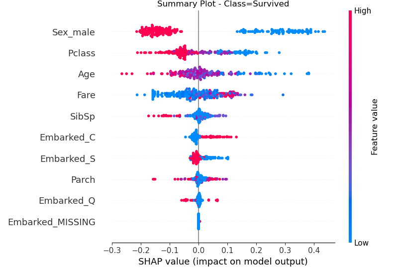

# Shap-with-the-Titanic

## Shap Summary Plot Interpretation:

#### Sex_male:

Being male decreased the likelihood of being predicted to be a Survivor

#### Fare:

The higher the fare, the more likely the model will predict they will Survive.

#### Pclass:

The better the passenger class (lower is better) the more likely the model will predict they will Survive.

#### Age:

The older the passenger, the more likely the model will predict them to die.

#### SibSp:

The more family members, the less likely the model will predict them to Survive.

These make intuitive sense due to "Women and children first", as well as first class passengers being prioritized.
